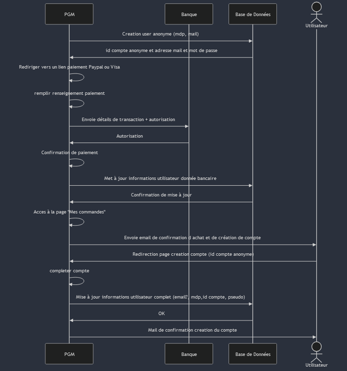

# Diagramme de séquence
### Paiement des voyages

```ts 
sequenceDiagram
    participant PGM
    participant Banque
    participant Base de Données
    actor Utilisateur

    PGM->>Base de Données: Creation user anonyme (mdp, mail)
    Base de Données->>PGM: id compte anonyme et adresse mail et mot de passe
    PGM->>PGM: Rediriger vers un lien paiement Paypal ou Visa
    PGM->>PGM: remplir renseignement paiement
    PGM->>Banque: Envoie détails de transaction + autorisation
    Banque->>PGM: Autorisation
    PGM->>PGM: Confirmation de paiement
    PGM->>Base de Données: Met à jour informations utilisateur donnée bancaire
    Base de Données->>PGM: Confirmation de mise à jour
    PGM ->> PGM: Acces à la page "Mes commandes"
    PGM->>Utilisateur: Envoie email de confirmation d achat et de création de compte
    Utilisateur ->> PGM: Redirection page creation compte (id compte anonyme)
    PGM ->> PGM:  completer compte
    PGM->>Base de Données: Mise à jour informations utilisateur complet (email?, mdp,id compte, pseudo)
    Base de Données->>PGM: OK
    PGM ->>Utilisateur : Mail de confirmation creation du compte

```



## Diagramme de classe

```ts

```

# Diagramme de séquence
### Paiement de la version premium

```ts

```

